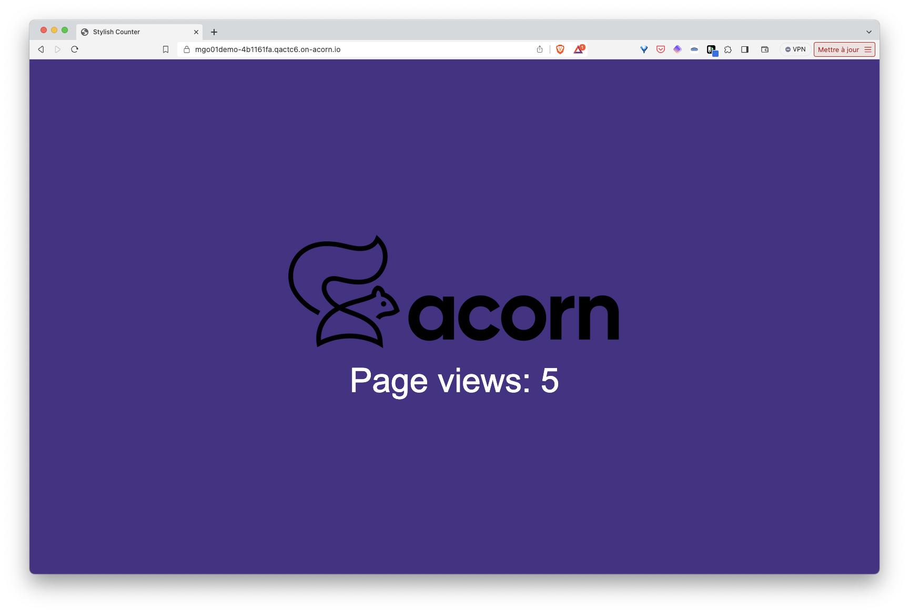
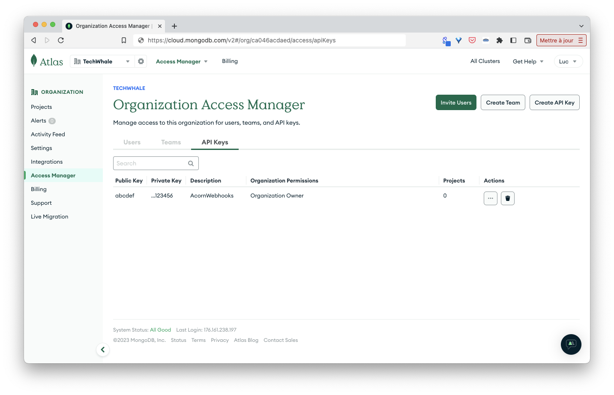
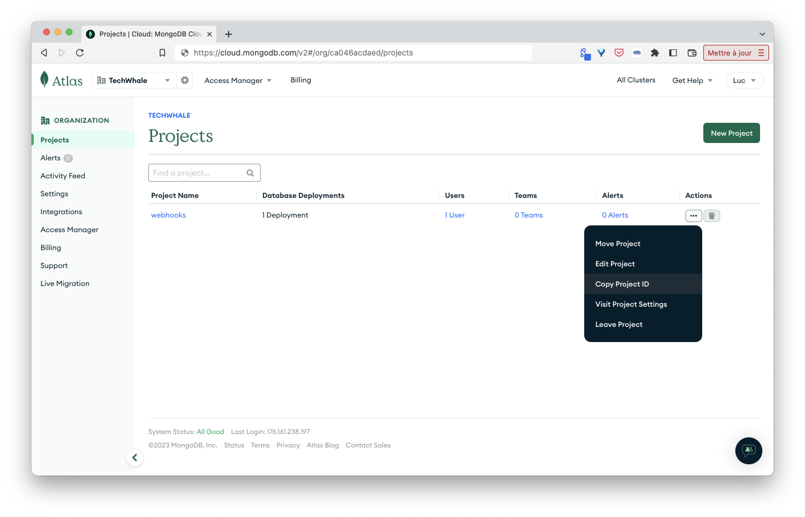

## Purpose

This folder defines an Acorn service which allows to create a Mongo Atlas cluster on the fly. To create the Mongo cluster, the Acorn interacts with Mongo Atlas APIs with user provided credentials.

In this very early version each cluster created by the service has the following characteristics, they are currently hardcoded but will soon become service's arguments:

- cloud provider: AWS
- region: US_EAST_1
- tier: M0

Notes:

- only one M0 cluster can be created in each Atlas project
- for cluster other than M0 tier billing information needs to be provided in Atlas

## Atlas Credentials

To use this service you need to have an Atlas Mongo account, to create an organization and a project within this one. Once deployped, you can click on the "cred-helper" link in the UI or from the CLI status. The link will open a browser page that instructs you how to get API keys for Atlas.

Once you save the credentials through the UI form, the cluster will be provisioned.

## Usage

The [examples folder](https://github.com/acorn-io/mongodb-atlas/tree/main/examples) contains a sample application using this Service. This app consists in a Python backend based on the FastAPI library, it displays a web page indicating the number of times the application was called, a counter is saved in the underlying MongoDB database and incremented with each request. The screenshot below shows the UI of the example application.



To use the Mongo Service, we first define a *service* property in the Acornfile of the application:

```
services: db: {
  image: "ghcr.io/acorn-io/mongodb-atlas:v#.#-#"
}
```

Next we define the application container. This one can connect to the MongoDB service via environment variables which values are set based on the service's properties.

```
containers: {
  app: {
    build: {
   context: "."
   target:  "dev"
  }
    consumes: ["db"]
    ports: publish: "8000/http"
    env: {
      DB_HOST:  "@{service.db.address}"
      DB_NAME:  "@{service.db.data.dbName}"
      DB_PROTO: "@{service.db.data.proto}"
      DB_USER:  "@{service.db.secrets.user.username}"
      DB_PASS:  "@{service.db.secrets.user.password}"
    }
  }
}
```

This container is built using the Dockerfile in the examples folder. Once built, the container consumes the MongoDB Atlas service using the address and credentials provided through via the dedicated variables.

This example can be run with the following command (to be run from the *examples* folder)

```
acorn run -n app
```

After a few tens of seconds an http endpoint will be returned. Using this endpoint we can access the application and see the counter incremented on each reload of the page.

## Running the app in Acorn Sandbox

Instead of managing your own Acorn installation, you can deploy this application in the Acorn Sandbox, the free SaaS offering provided by Acorn. Access to the sandbox requires only a GitHub account, which is used for authentication.

[](https://acorn.io/run/ghcr.io/acorn-io/mongodb-atlas/examples:v%23.%23-%23)

An application running in the Sandbox will automatically shut down after 2 hours, but you can use the Acorn Pro plan to remove the time limit and gain additional functionalities.

## Consume an existing secret

This Acorn will need credentials to interact with the Atlas API. These credentials are stored in a secret named *atlas-creds*. This secret needs to be created ahead of time by the user.

You will need to launch the acorn with the following argument set: `--useExternalCreds`
This will tell Acorn to use the external secret instead of prompting for one.

Note: this example uses an organization named *Techwhale* containing the project *webhooks*

Next create a public / private api key pair at the organization level



Next get the project ID



For this demo I set those 3 values in the following environment variables:

- MONGODB_ATLAS_PUBLIC_API_KEY
- MONGODB_ATLAS_PRIVATE_API_KEY
- MONGODB_ATLAS_PROJECT_ID

Next we need to create the secret *atlas-creds* providing the public and private keys as well as the Atlas project ID we want the MongoDB cluster to be created in.

Note: the following example uses environment variables already defined in the current shell

```
acorn secrets create \
  --type credential.cloud.mongodb.com/atlas \
  --data public_key=$MONGODB_ATLAS_PUBLIC_API_KEY \
  --data private_key=$MONGODB_ATLAS_PRIVATE_API_KEY \
  --data project_id=$MONGODB_ATLAS_PROJECT_ID \
  atlas-creds
```

## Updating/Upgrading

When changing Tiers, you must follow the MongoDB atlas upgrade path. You can only upgrade an M0, M2, or M5 Cluster to an M10+ Cluster.

## Status

This service is still a work in progress. Feedback are welcome.
